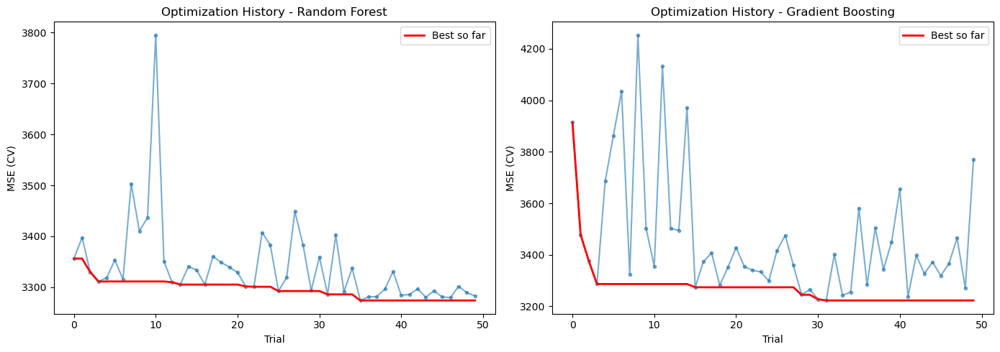
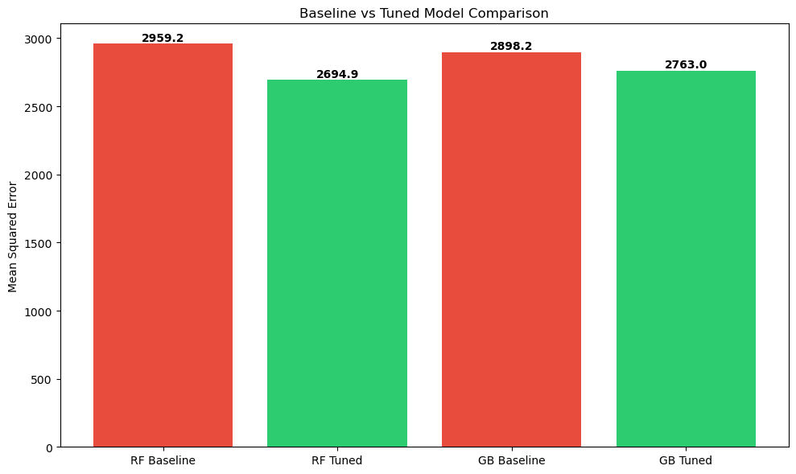

# Hyperparameter Tuning Lab - Diabetes Prediction with Optuna 🎯

## Overview
This lab demonstrates **automated hyperparameter tuning** using Optuna with MLflow integration. Two models (Random Forest, Gradient Boosting) are tuned on the Diabetes dataset, and results are compared against untuned baselines.

## Based On
Original HyperOpt Lab from [Prof. Ramin Mohammadi's MLOps Repo](https://github.com/raminmohammadi/MLOps/tree/main/Labs/HyperOpt_Labs) — Hyperparameter optimization using HyperOpt library.

## Modifications from Original

| # | Original Lab | This Lab |
|---|----------|----------|
| 1 | HyperOpt library | **Optuna** — more modern, better visualization support |
| 2 | Original dataset | **Diabetes** dataset (sklearn, regression task) |
| 3 | Single model tuning | **Two models** tuned: Random Forest + Gradient Boosting |
| 4 | No baseline comparison | **Baseline vs Tuned** comparison with bar chart |
| 5 | No visualization | **Optimization history** plots + model comparison chart |
| 6 | No experiment logging | **MLflow integration** — all best runs logged |
| 7 | Basic parameter search | **50 trials per model** with cross-validation scoring |
| 8 | Classification task | **Regression task** — MSE, MAE, R² metrics |

## How to Run

```bash
cd hyperopt_lab
pip install -r requirements.txt
python hyperparameter_tuning.py
```

View MLflow results:
```bash
mlflow ui
```
Open **http://localhost:5000**

## What It Does
1. Loads the Diabetes dataset (442 samples, 10 features)
2. Trains **baseline models** with default parameters
3. Runs **Optuna optimization** (50 trials each) for Random Forest and Gradient Boosting
4. Evaluates tuned models on test set
5. Logs best models and metrics to **MLflow**
6. Generates **visualization plots** (optimization history, baseline vs tuned)

## Results

### Optimization History
Shows how MSE improves over 50 trials for both models. The red line tracks the best score found so far.



### Baseline vs Tuned Comparison
Tuned models (green) consistently outperform baseline models (red), showing clear MSE reduction after Optuna optimization.



### Results Summary
```
                          MSE       MAE      R2
RandomForest_Baseline   2959.2    43.52   0.4431
RandomForest_Tuned      2694.9    41.38   0.4928
GradientBoosting_Baseline 2898.2  43.36   0.4546
GradientBoosting_Tuned  2763.0    42.02   0.4800
```

## Output Files
- `screenshots/optimization_history.png` — Trial-by-trial MSE for both models
- `screenshots/model_comparison.png` — Baseline vs Tuned bar chart
- `mlruns/` — MLflow experiment logs

## Project Structure
```
hyperopt_lab/
├── hyperparameter_tuning.py   # Main script
├── requirements.txt           # Dependencies
├── README.md                  # This file
├── screenshots/
│   ├── optimization_history.png
│   └── model_comparison.png
└── mlruns/                    # Auto-generated by MLflow
```

## Technologies Used
- **Optuna** — Bayesian hyperparameter optimization
- **MLflow** — Experiment tracking and model logging
- **scikit-learn** — Random Forest, Gradient Boosting regressors
- **Matplotlib** — Visualization

## Author
Aaditya — Northeastern University, MS Data Analytics Engineering