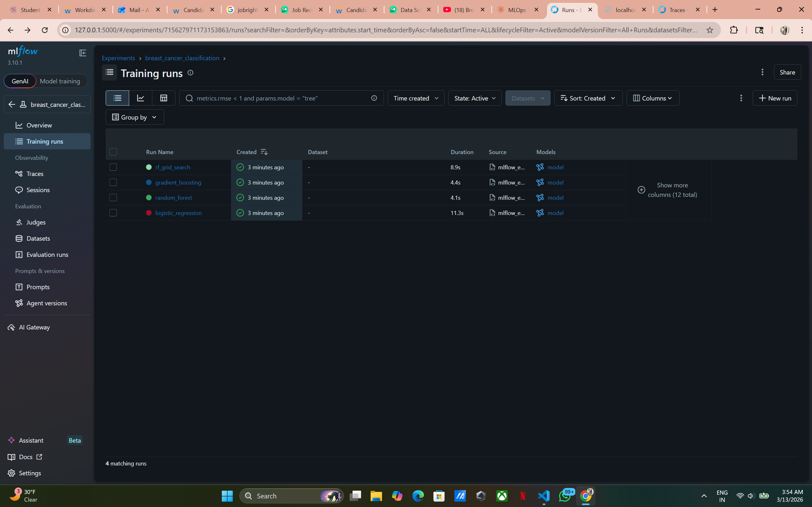
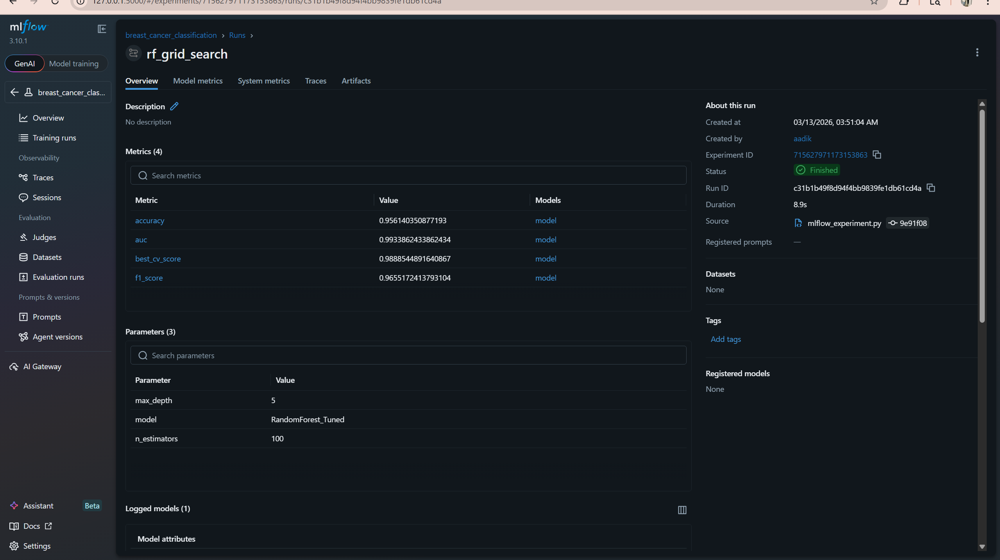
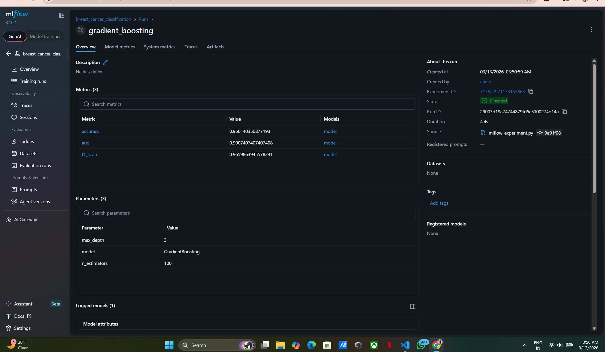
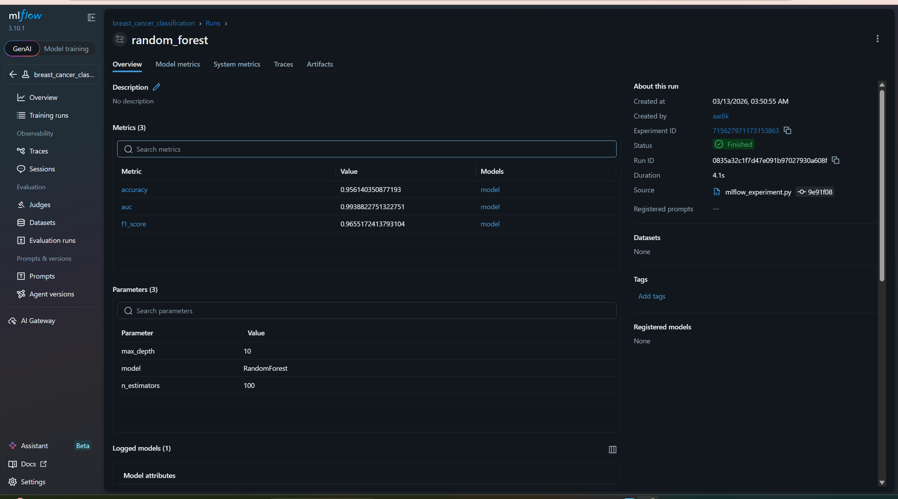
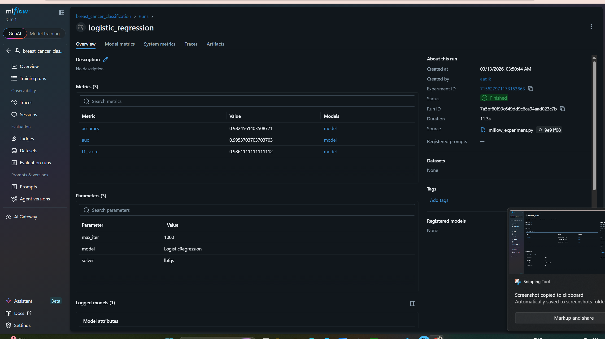

# MLflow Lab - Breast Cancer Classification with Experiment Tracking 🔬

## Overview
This lab demonstrates **MLflow experiment tracking** by training and comparing multiple machine learning models on the Breast Cancer dataset. All parameters, metrics, artifacts (plots), and models are logged to MLflow for comparison and reproducibility.

## Based On
Original MLflow Lab-2 from [Prof. Ramin Mohammadi's MLOps Repo](https://github.com/raminmohammadi/MLOps/tree/main/Labs/Mlflow_Labs/Lab2) — Wine Quality prediction with PySpark, MLflow Model Registry, and model serving.

## Modifications from Original

| # | Original Lab | This Lab |
|---|----------|----------|
| 1 | Wine Quality CSV dataset | **Breast Cancer** dataset (sklearn built-in, 569 samples, 30 features) |
| 2 | Only Random Forest model | **4 runs**: Logistic Regression, Random Forest, Gradient Boosting, RF with GridSearch |
| 3 | Requires Java + PySpark setup | **No Java/PySpark needed** — pure scikit-learn |
| 4 | Manual single-param logging | **GridSearchCV** with automatic best parameter logging |
| 5 | No visualization artifacts | **Confusion matrix + ROC curve** plots saved as MLflow artifacts per run |
| 6 | Model serving via CLI (Step 14-15) | Simplified — focus on experiment tracking & model comparison |
| 7 | Jupyter notebook format | **Python script** — single command to run all experiments |
| 8 | No model comparison | **Summary table** printed comparing all 4 models side by side |
| 9 | Basic metric logging (AUC only) | **Multiple metrics**: Accuracy, F1 Score, AUC logged per run |
| 10 | No data preprocessing | **StandardScaler** applied + stratified train/test split |

## How to Run

### 1. Install dependencies
```bash
cd mlflow_lab
pip install -r requirements.txt
```

### 2. Run the experiment
```bash
python mlflow_experiment.py
```
This will train all 4 models and log everything to MLflow. You'll see a summary table printed in the terminal.

### 3. View results in MLflow UI
```bash
mlflow ui
```
Open **http://localhost:5000** in your browser.

## MLflow UI Screenshots

### Training Runs Overview
All 4 experiment runs completed successfully:



### RF Grid Search Run
Best hyperparameters found via GridSearchCV (max_depth=5, n_estimators=100):



### Gradient Boosting Run
Metrics: Accuracy 0.956, AUC 0.990, F1 0.966:



### Random Forest Run
Metrics: Accuracy 0.956, AUC 0.994, F1 0.966:



### Logistic Regression Run
Best overall — Accuracy 0.982, AUC 0.995, F1 0.986:



## Technologies Used
- **MLflow** — Experiment tracking, model logging, artifact storage
- **scikit-learn** — Model training (Logistic Regression, Random Forest, Gradient Boosting)
- **Matplotlib / Seaborn** — Visualization (confusion matrix, ROC curves)
- **Pandas / NumPy** — Data manipulation
- **GridSearchCV** — Hyperparameter tuning

## Project Structure
```
mlflow_lab/
├── mlflow_experiment.py   # Main script — runs all experiments
├── requirements.txt       # Python dependencies
├── README.md              # This file
├── screenshots/           # MLflow UI screenshots
│   ├── training_runs.png
│   ├── rf_grid_search.png
│   ├── gradient_boosting.png
│   ├── random_forest.png
│   └── logistic_regression.png
└── mlruns/                # Auto-generated by MLflow (experiment data)
```

## Sample Output
```
============================================================
EXPERIMENT SUMMARY
============================================================
                Model  Accuracy  F1 Score      AUC
  Logistic Regression    0.9825    0.9861   0.9954
        Random Forest    0.9561    0.9655   0.9939
    Gradient Boosting    0.9561    0.9660   0.9907
           RF (Tuned)    0.9561    0.9655   0.9934
============================================================
```

## Author
Aaditya — Northeastern University, MS Data Analytics Engineering